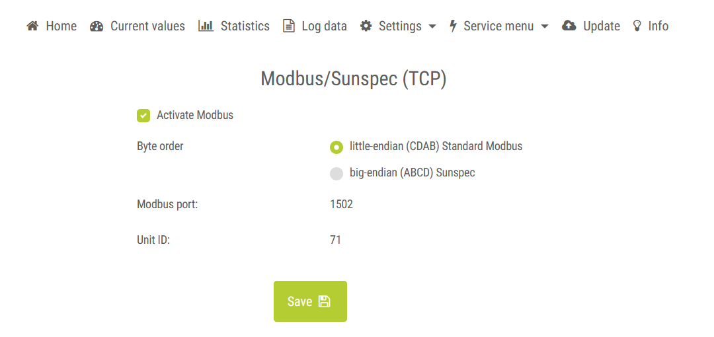

# Modbus Kostal Inverter Binding

This binding integrates Kostal Plenticore and Piko inverters into openHAB based on modbus.
It is based on the [KOSTAL Interface description
MODBUS (TCP) & SunSpec](https://cdn-production.kostal.com/-/media/document-library-folder---kse/2023/11/16/13/29/ba_kostal-interface-description-modbus-tcp_sunspec_hybrid.pdf).

**Note:** Modbus needs to be enabled in the inverter. 
Depending on the inverter model and / or firmware version this may require solar installer access. 


## Supported Inverters
The following inverters / firmware version are supported by this binding (according to the documentation):

* PIKO/PLENTICORE G1: FW 01.79 / UI 01.29.12038
* PLENTICORE G2: FW 02.10 / UI 02.10.13265
* PLENTICORE G3: SW 3.03.09.14405

Older firmware versions should work as well, but might not support all channels / channel groups.

The binding has been tested with the following models:
* Plenticore BI G2

## Supported Things

Currently, the binding supports only one thing:

- `plenticore`: The Kostal Piko/Plenticore inverter

## Discovery
None

## Preparation

The data from the inverter is read via Modbus. 

This means you need to enable modbus in the inverter under "Settings" / "Modbus/Sunspec (TCP)" (might require solar installer access on some older firmware versions).


Moreover, in OpenHAB you need to configure a Modbus TCP Slave `tcp` as bridge first. 
Unit Id and Port need to match the one from the modbus configuration of the inverter (default Unit Id is `71`!).

## Thing Configuration

Once you've configured the Modbus TCP Slave as Bridge you can configure the Kostal inverter thing.
You just have to select the configured bridge and optionally configure the polling interval and endianness.

### Plenticore Inverter (`plenticore`)

| Name         | Type    | Description                                                                              | Default | Required | Advanced |
|--------------|---------|------------------------------------------------------------------------------------------|---------|----------|----------|
| pollInterval | integer | Interval the device is polled in ms.                                                     | 5000    | yes      | no       |
| maxTries     | integer | Number of tries when reading data, if some of the reading fail. For single try, enter 1. | 3       | yes      | yes      | 
| littleEndian | boolean | Little Endian (default) or Big Endian.                                                   | true    | yes      | yes      |

## Supported Channels

### Channel Group "Device Information"

| Channel Type ID                                | Item Type     | Description                 | Advanced |
|------------------------------------------------|---------------|-----------------------------|----------|
| device-information#inverter-state              | String        | Inverter State              | no       |
| device-information#inverter-state-raw          | Number        | Raw Inverter State          | yes      |
| device-information#state-of-energy-manager     | String        | State of Energy Manager     | no       |
| device-information#state-of-energy-manager-raw | Number        | Raw State of Energy Manager | yes      |
| device-information#total-dc-power              | Number:Power  | Total DC Power              | no       |
| device-information#total-ac-to-grid            | Number:Energy | Total AC to Grid            | no       |

### Channel Group "Consumption"

| Channel Type ID                               | Item Type            | Description                       | Advanced |
|-----------------------------------------------|----------------------|-----------------------------------|----------|
| consumption#home-own-consumption-from-battery | Number:Power         | Home own consumption from battery | no       |
| consumption#home-own-consumption-from-grid    | Number:Power         | Home own consumption from grid    | no       |
| consumption#home-own-consumption-pv           | Number:Power         | Home own consumption from PV      | no       |
| consumption#total-home-consumption-battery    | Number:Energy        | Total home consumption Battery    | no       |
| consumption#total-home-consumption-grid       | Number:Energy        | Total home consumption Grid       | no       |
| consumption#total-home-consumption-pv         | Number:Energy        | Total home consumption PV         | no       |
| consumption#total-home-consumption            | Number:Energy        | Total home consumption            | no       |
| consumption#total-home-consumption-rate       | Number:Dimensionless | Total home consumption rate       | no       |

### Channel Group "Statistics"

| Channel Type ID          | Item Type     | Description   | Advanced |
|--------------------------|---------------|---------------|----------|
| statistics#total-yield   | Number:Energy | Total Yield   | no       |
| statistics#daily-yield   | Number:Energy | Daily Yield   | no       |
| statistics#monthly-yield | Number:Energy | Monthly Yield | no       |
| statistics#yearly-yield  | Number:Energy | Yearly Yield  | no       |

### Channel Group "Grid Information"

| Channel Type ID                          | Item Type    | Description             | Advanced |
|------------------------------------------|--------------|-------------------------|----------|
| grid-information#total-ac-active-power   | Number:Power | Total AC active power   | no       |
| grid-information#total-ac-reactive-power | Number:Power | Total AC reactive power | no       |
| grid-information#total-ac-apparent-power | Number:Power | Total AC apparent power | no       |

### Channel Group "Battery Information"

| Channel Type ID                                             | Item Type                | Description                                       | Advanced |
|-------------------------------------------------------------|--------------------------|---------------------------------------------------|----------|
| battery-information#battery-charge-current                  | Number:ElectricCurrent   | Battery charge current                            | no       |
| battery-information#actual-battery-charge-discharge-current | Number:ElectricCurrent   | Actual battery charge (-) / discharge (+) current | no       |
| battery-information#actual-state-of-charge                  | Number:Dimensionless     | Actual state of charge                            | no       |
| battery-information#battery-actual-soc                      | Number:Dimensionless     | Actual SOC                                        | no       |
| battery-information#total-dc-to-battery                     | Number:Energy            | Total DC charge energy (DC-side to battery)       | no       |
| battery-information#total-dc-from-battery                   | Number:Energy            | Total DC discharge energy (DC-side from battery)  | no       |
| battery-information#total-ac-to-battery                     | Number:Energy            | Total AC charge energy (AC-side to battery)       | no       |
| battery-information#total-battery-to-grid                   | Number:Energy            | Total AC discharge energy (battery to grid)       | no       |
| battery-information#total-grid-to-battery                   | Number:Energy            | Total AC charge energy (grid to battery)          | no       |
| battery-information#battery-temperature                     | Number:Temperature       | Battery Temperature                               | no       |
| battery-information#battery-voltage                         | Number:ElectricPotential | Battery voltage                                   | no       |
| battery-information#number-of-battery-cycles                | Number:Dimensionless     | Number of Battery Cycles                          | no       |
| battery-information#battery-work-capacity                   | Number:Energy            | Battery work capacity                             | no       |
| battery-information#battery-max-charge-power-limit          | Number:Power             | Battery max. charge power limit, absolute         | no       |
| battery-information#battery-max-discharge-power-limit       | Number:Power             | Battery max. discharge power limit, absolute      | no       |
| battery-information#minimum-soc                             | Number:Dimensionless     | Minimum SOC                                       | no       |
| battery-information#maximum-soc                             | Number:Dimensionless     | Maximum SOC                                       | no       |

### Channel Group "String Information"

| Channel Type ID                        | Item Type     | Description                               | Advanced |
|----------------------------------------|---------------|-------------------------------------------|----------|
| string-information#total-dc-pv-energy  | Number:Energy | Total DC PV energy (sum of all PV inputs) | no       |
| string-information#total-dc-energy-pv1 | Number:Energy | Total DC energy from PV1                  | no       |
| string-information#total-dc-energy-pv2 | Number:Energy | Total DC energy from PV2                  | no       |
| string-information#total-dc-energy-pv3 | Number:Energy | Total DC energy from PV3                  | no       |
| string-information#total-dc-power-pv   | Number:Power  | Total DC power (sum of all PV inputs)     | no       |

## Full Example

This example shows how to configure a Kostal Plenticore inverter connected via modbus and uses the most common channels.

_kostal.things_

```
Bridge modbus:tcp:kostal-inverter "Kostal Plenticore" [host="plenticore", port=1502, id=71] {
    Thing plenticore plenticore "Kostal Plenticore Inverter" [ pollInterval=5000, littleEndian=true ]
}
```

_kostal.items_

```
// Device Information
String                inverter_state                         "Inverter State [%s]"                  [ "Point" ]                     { channel="modbus:plenticore:kostal-inverter:plenticore:device-information#inverter-state" }
Number                inverter_state_raw                     "Raw Inverter State [%d]"              [ "Point" ]                     { channel="modbus:plenticore:kostal-inverter:plenticore:device-information#inverter-state-raw" }

String                state_of_energy_manager                "State of Energy Manager [%s]"         [ "Point" ]                     { channel="modbus:plenticore:kostal-inverter:plenticore:device-information#state-of-energy-manager" }
Number                state_of_energy_manager_raw            "Raw State of Energy Manager [%d]"     [ "Point" ]                     { channel="modbus:plenticore:kostal-inverter:plenticore:device-information#state-of-energy-manager-raw" }

// Consumption
Number:Power          total_dc_power                         "Total DC Power [%.1f %%unit%%]"       [ "Measurement", "Power" ]      { channel="modbus:plenticore:kostal-inverter:plenticore:consumption#total-dc-power" }
Number:Energy         total_ac_to_grid                       "Total AC to Grid [%.1f %%unit%%]"     [ "Measurement", "Energy" ]     { channel="modbus:plenticore:kostal-inverter:plenticore:consumption#total-ac-to-grid" }
Number:Power          home_own_consumption_from_battery      "Home own consumption from battery [%.1f %%unit%%]"    [ "Measurement", "Power" ]      { channel="modbus:plenticore:kostal-inverter:plenticore:consumption#home-own-consumption-from-battery" }
Number:Power          home_own_consumption_from_grid         "Home own consumption from grid [%.1f %%unit%%]"       [ "Measurement", "Power" ]      { channel="modbus:plenticore:kostal-inverter:plenticore:consumption#home-own-consumption-from-grid" }
Number:Power          home_own_consumption_pv                "Home own consumption from PV [%.1f %%unit%%]"         [ "Measurement", "Power" ]      { channel="modbus:plenticore:kostal-inverter:plenticore:consumption#home-own-consumption-pv" }
Number:Energy         total_home_consumption_battery         "Total home consumption Battery [%.1f %%unit%%]"       [ "Measurement", "Energy" ]     { channel="modbus:plenticore:kostal-inverter:plenticore:consumption#total-home-consumption-battery" }
Number:Energy         total_home_consumption_grid            "Total home consumption Grid [%.1f %%unit%%]"          [ "Measurement", "Energy" ]     { channel="modbus:plenticore:kostal-inverter:plenticore:consumption#total-home-consumption-grid" }
Number:Energy         total_home_consumption_pv              "Total home consumption PV [%.1f %%unit%%]"            [ "Measurement", "Energy" ]     { channel="modbus:plenticore:kostal-inverter:plenticore:consumption#total-home-consumption-pv" }
Number:Energy         total_home_consumption                 "Total home consumption [%.1f %%unit%%]"               [ "Measurement", "Energy" ]     { channel="modbus:plenticore:kostal-inverter:plenticore:consumption#total-home-consumption" }
Number:Dimensionless  total_home_consumption_rate            "Total home consumption rate [%.1f %%unit%%]"          [ "Measurement"]                { channel="modbus:plenticore:kostal-inverter:plenticore:consumption#total-home-consumption-rate" }

// Statistics
Number:Energy         total_yield                            "Total Yield [%.1f %%unit%%]"                          [ "Measurement", "Energy" ]      { channel="modbus:plenticore:kostal-inverter:plenticore:statistics#total-yield" }
Number:Energy         daily_yield                            "Daily Yield [%.1f %%unit%%]"                          [ "Measurement", "Energy" ]      { channel="modbus:plenticore:kostal-inverter:plenticore:statistics#daily-yield" }
Number:Energy         monthly_yield                          "Monthly Yield [%.1f %%unit%%]"                        [ "Measurement", "Energy" ]      { channel="modbus:plenticore:kostal-inverter:plenticore:statistics#monthly-yield" }
Number:Energy         yearly_yield                           "Yearly Yield [%.1f %%unit%%]"                         [ "Measurement", "Energy" ]      { channel="modbus:plenticore:kostal-inverter:plenticore:statistics#yearly-yield" }

// Grid Information
Number:Power          total_ac_active_power                  "Total AC active power [%.1f %%unit%%]"                [ "Measurement", "Power" ]      { channel="modbus:plenticore:kostal-inverter:plenticore:grid-information#total-ac-active-power" }
Number:Power          total_ac_reactive_power                "Total AC reactive power [%.1f %%unit%%]"              [ "Measurement", "Power" ]      { channel="modbus:plenticore:kostal-inverter:plenticore:grid-information#total-ac-reactive-power" }
Number:Power          total_ac_apparent_power                "Total AC apparent power [%.1f %%unit%%]"              [ "Measurement", "Power" ]      { channel="modbus:plenticore:kostal-inverter:plenticore:grid-information#total-ac-apparent-power" }

// Battery Information
Number:ElectricCurrent    battery_charge_current                   "Battery charge current [%.1f %%unit%%]"                             [ "Measurement", "Current" ]      { channel="modbus:plenticore:kostal-inverter:plenticore:battery-information#battery-charge-current" }
Number:ElectricCurrent    actual_battery_charge_discharge_current  "Actual battery charge (-) / discharge (+) current [%.1f %%unit%%]"  [ "Measurement", "Current" ]      { channel="modbus:plenticore:kostal-inverter:plenticore:battery-information#actual-battery-charge-discharge-current" }
Number:Dimensionless      actual_state_of_charge                   "Actual state of charge [%.1f %%]"                                   [ "Measurement" ]                 { channel="modbus:plenticore:kostal-inverter:plenticore:battery-information#actual-state-of-charge" }
Number:Energy             total_dc_to_battery                      "Total DC charge energy (DC-side to battery) [%.1f %%unit%%]"        [ "Measurement", "Energy" ]       { channel="modbus:plenticore:kostal-inverter:plenticore:battery-information#total-dc-to-battery" }
Number:Energy             total_dc_from_battery                    "Total DC discharge energy (DC-side from battery) [%.1f %%unit%%]"   [ "Measurement", "Energy" ]       { channel="modbus:plenticore:kostal-inverter:plenticore:battery-information#total-dc-from-battery" }
Number:Energy             total_ac_to_battery                      "Total AC charge energy (AC-side to battery) [%.1f %%unit%%]"        [ "Measurement", "Energy" ]       { channel="modbus:plenticore:kostal-inverter:plenticore:battery-information#total-ac-to-battery" }
Number:Energy             total_battery_to_grid                    "Total AC discharge energy (battery to grid) [%.1f %%unit%%]"        [ "Measurement", "Energy" ]       { channel="modbus:plenticore:kostal-inverter:plenticore:battery-information#total-battery-to-grid" }
Number:Energy             total_grid_to_battery                    "Total AC charge energy (grid to battery) [%.1f %%unit%%]"          [ "Measurement", "Energy" ]       { channel="modbus:plenticore:kostal-inverter:plenticore:battery-information#total-grid-to-battery" }
Number:Temperature        battery_temperature                      "Battery Temperature [%.1f %%unit%%]"                                [ "Measurement", "Temperature" ]  { channel="modbus:plenticore:kostal-inverter:plenticore:battery-information#battery-temperature" }
Number:ElectricPotential  battery_voltage                          "Battery voltage [%.1f %%unit%%]"                                    [ "Measurement", "Voltage" ]      { channel="modbus:plenticore:kostal-inverter:plenticore:battery-information#battery-voltage" }
Number:Dimensionless      number_of_battery_cycles                 "Number of Battery Cycles [%.1f]"                           [ "Measurement" ]                 { channel="modbus:plenticore:kostal-inverter:plenticore:battery-information#number-of-battery-cycles" }
Number:Energy             battery_work_capacity                    "Battery work capacity [%.1f %%unit%%]"                              [ "Measurement", "Energy" ]       { channel="modbus:plenticore:kostal-inverter:plenticore:battery-information#battery-work-capacity" }
Number:Power              battery_max_charge_power_limit           "Battery max. charge power limit, absolute [%.1f %%unit%%]"          [ "Measurement", "Power" ]        { channel="modbus:plenticore:kostal-inverter:plenticore:battery-information#battery-max-charge-power-limit" }
Number:Power              battery_max_discharge_power_limit        "Battery max. discharge power limit, absolute [%.1f %%unit%%]"       [ "Measurement", "Power" ]        { channel="modbus:plenticore:kostal-inverter:plenticore:battery-information#battery-max-discharge-power-limit" }
Number:Dimensionless      minimum_soc                              "Minimum SOC [%.1f %%]"                                              [ "Measurement" ]                 { channel="modbus:plenticore:kostal-inverter:plenticore:battery-information#minimum-soc" }
Number:Dimensionless      maximum_soc                              "Maximum SOC [%.1f %%]"                                              [ "Measurement" ]                 { channel="modbus:plenticore:kostal-inverter:plenticore:battery-information#maximum-soc" }

// String Information
Number:Energy             total_dc_pv_energy                        "Total DC PV energy (sum of all PV inputs) [%.1f %%unit%%]"         [ "Measurement", "Energy" ]       { channel="modbus:plenticore:kostal-inverter:plenticore:string-information#total-dc-pv-energy" }
Number:Energy             total_dc_energy_pv1                       "Total DC energy from PV1 [%.1f %%unit%%]"                          [ "Measurement", "Energy" ]       { channel="modbus:plenticore:kostal-inverter:plenticore:string-information#total-dc-energy-pv1" }
Number:Energy             total_dc_energy_pv2                       "Total DC energy from PV2 [%.1f %%unit%%]"                          [ "Measurement", "Energy" ]       { channel="modbus:plenticore:kostal-inverter:plenticore:string-information#total-dc-energy-pv2" }
Number:Energy             total_dc_energy_pv3                       "Total DC energy from PV3 [%.1f %%unit%%]"                          [ "Measurement", "Energy" ]       { channel="modbus:plenticore:kostal-inverter:plenticore:string-information#total-dc-energy-pv3" }
Number:Power              total_dc_power_pv                         "Total DC power (sum of all PV inputs) [%.1f %%unit%%]"             [ "Measurement", "Power" ]        { channel="modbus:plenticore:kostal-inverter:plenticore:string-information#total-dc-power-pv" }
```

_kostal.sitemap_

```
sitemap kostal label="Kostal Plenticore"
{
    Frame label="Device Information"  icon="inverter"  {
        Text     item=inverter_state                            label="Inverter State [%s]"
        Text     item=inverter_state_raw                        label="Raw Inverter State [%d]"
        Text     item=state_of_energy_manager                   label="State of Energy Manager [%s]"
        Text     item=state_of_energy_manager_raw               label="Raw State of Energy Manager [%d]"
    }

    Frame label="Consumption"  icon="inverter"  {
        Text     item=total_dc_power                            label="Total DC Power [%.1f %unit%]"
        Text     item=total_ac_to_grid                          label="Total AC to Grid [%.1f %unit%]"
        Text     item=home_own_consumption_from_battery         label="Home own consumption from battery [%.1f %unit%]"
        Text     item=home_own_consumption_from_grid            label="Home own consumption from grid [%.1f %unit%]"
        Text     item=home_own_consumption_pv                   label="Home own consumption from PV [%.1f %unit%]"
        Text     item=total_home_consumption_battery            label="Total home consumption Battery [%.1f %unit%]"
        Text     item=total_home_consumption_grid               label="Total home consumption Grid [%.1f %unit%]"
        Text     item=total_home_consumption_pv                 label="Total home consumption PV [%.1f %unit%]"
        Text     item=total_home_consumption                    label="Total home consumption [%.1f %unit%]"
        Text     item=total_home_consumption_rate               label="Total home consumption rate [%.1f %unit%]"
    }

    Frame label="Statistics"  icon="inverter"  {
        Text     item=total_yield                               label="Total Yield [%.1f %unit%]"
        Text     item=daily_yield                               label="Daily Yield [%.1f %unit%]"
        Text     item=monthly_yield                             label="Monthly Yield [%.1f %unit%]"
        Text     item=yearly_yield                              label="Yearly Yield [%.1f %unit%]"
    }

    Frame label="Grid Information"  icon="inverter"  {
        Text     item=total_ac_active_power                     label="Total AC active power [%.1f %unit%]"
        Text     item=total_ac_reactive_power                   label="Total AC reactive power [%.1f %unit%]"
        Text     item=total_ac_apparent_power                   label="Total AC apparent power [%.1f %unit%]"
    }

    Frame label="Battery Information"  icon="inverter"  {
      Text       item=battery_charge_current                    label="Battery charge current [%.1f %unit%]"
      Text       item=actual_battery_charge_discharge_current   label="Actual battery charge (-) / discharge (+) current [%.1f %unit%]"
      Text       item=actual_state_of_charge                    label="Actual state of charge [%.1f %%]"
      Text       item=total_dc_to_battery                       label="Total DC charge energy (DC-side to battery) [%.1f %unit%]"
      Text       item=total_dc_from_battery                     label="Total DC discharge energy (DC-side from battery) [%.1f %unit%]"
      Text       item=total_ac_to_battery                       label="Total AC charge energy (AC-side to battery) [%.1f %unit%]"
      Text       item=total_battery_to_grid                     label="Total AC discharge energy (battery to grid) [%.1f %unit%]"
      Text       item=total_grid_to_battery                     label="Total AC charge energy (grid to battery) [%.1f %unit%]"
      Text       item=battery_temperature                       label="Battery Temperature [%.1f %unit%]"
      Text       item=battery_voltage                           label="Battery voltage [%.1f %unit%]"
      Text       item=number_of_battery_cycles                  label="Number of Battery Cycles [%.1f]"
      Text       item=battery_work_capacity                     label="Battery work capacity [%.1f %unit%]"
      Text       item=battery_max_charge_power_limit            label="Battery max. charge power limit, absolute [%.1f %unit%]"
      Text       item=battery_max_discharge_power_limit         label="Battery max. discharge power limit, absolute [%.1f %unit%]"
      Text       item=minimum_soc                               label="Minimum SOC [%.1f %%]"
      Text       item=maximum_soc                               label="Maximum SOC [%.1f %%]"
    }

    Frame label="String Information"  icon="inverter"  {
        Text     item=total_dc_pv_energy                        label="Total DC PV energy (sum of all PV inputs) [%.1f %unit%]"
        Text     item=total_dc_energy_pv1                       label="Total DC energy from PV1 [%.1f %unit%]"
        Text     item=total_dc_energy_pv2                       label="Total DC energy from PV2 [%.1f %unit%]"
        Text     item=total_dc_energy_pv3                       label="Total DC energy from PV3 [%.1f %unit%]"
        Text     item=total_dc_power_pv                         label="Total DC power (sum of all PV inputs) [%.1f %unit%]"
    }
}
```