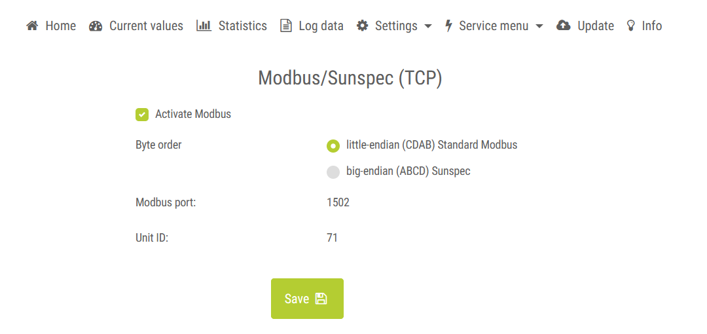

# Modbus Kostal Inverter Binding

This binding integrates kostal plenticore and piko inverters into openHAB based on modbus.
It is based on the [KOSTAL Interface description
MODBUS (TCP) & SunSpec](https://cdn-production.kostal.com/-/media/document-library-folder---kse/2023/11/16/13/29/ba_kostal-interface-description-modbus-tcp_sunspec_hybrid.pdf).

**Note:** Modbus needs to be enabled in the inverter. 
Depending on the inverter model and / or firmware version this may require solar installer access. 


## Supported Inverters
Theoretically the following inverters / firmware version should be supported (according to [KOSTAL Interface description
MODBUS (TCP) & SunSpec](https://cdn-production.kostal.com/-/media/document-library-folder---kse/2023/11/16/13/29/ba_kostal-interface-description-modbus-tcp_sunspec_hybrid.pdf)):

* PIKO/PLENTICORE G1: FW 01.79 / UI 01.29.12038
* PLENTICORE G2: FW 02.10 / UI 02.10.13265
* PLENTICORE G3: SW 3.03.09.14405

Tested models:
* Plenticore BI G2

Moreover, according to "KOSTAL Interface MODBUS (TCP) & SunSpec PIKO IQ / PLENTICORE plus" the following models may also be (partially) supported, but this is completely untested:
* PIKO IQ
* PLENTICORE plus

## Supported Things

The binding supports only one thing:

- `plenticore`: The piko/plenticore inverter

## Discovery
None

## Preparation

The data from the inverter is read via Modbus. 

This means you need to enable modbus in the inverter under "Settings" / "Modbus/Sunspec (TCP)".


Moreover, you in OpenHAB you need to configure a Modbus TCP Slave `tcp` as bridge first. 
Unit Id and Port need to match the one from the modbus configuration inverter.


## Thing Configuration

Once you've configured the Modbus TCP Slave as Bridge you can configure the Kostal inverter thing.
You just have to select the configured bridge and optional configure the polling interval and endianness.

### Plenticore Inverter (`plenticore`)

| Name         | Type    | Description                            | Default | Required | Advanced |
|--------------|---------|----------------------------------------|---------|----------|----------|
| pollInterval | integer | Interval the device is polled in ms.   | 5000    | yes      | no       |
| littleEndian | boolean | Little Endian (default) or Big Endian. | true    | yes      | no       |

## Channels

### Channel Group "Device Information"

| Channel Type ID                    | Item Type                | Description                           | Advanced  |
|------------------------------------|--------------------------|---------------------------------------|-----------|

### Channel Group "Battery Information"

| Channel Type ID                    | Item Type                | Description                           | Advanced  |
|------------------------------------|--------------------------|---------------------------------------|-----------|

### Channel Group "Statistics"

| Channel Type ID                    | Item Type                | Description                           | Advanced  |
|------------------------------------|--------------------------|---------------------------------------|-----------|

## Full Example

This example shows how to configure a kostal plenticore inverter connected via modbus and uses the most common channels.

_kostal.things_

```java
Bridge modbus:tcp:kostal-inverter [ host="10.0.0.2", port=1502, id=71, enableDiscovery=false ] {
    Thing plenticore plenticore "Plenticore Inverter" [ pollInterval=5000 ]
}
```

_kostal.items_

```java
// Groups
Group plenticoreInverter "Plenticore Inverter" ["Inverter"]

```

_sungrow.sitemap_

```perl
sitemap plenticore label="Plenticore Binding"
{
    Frame {
        Text item=total_active_power

    }
}
```